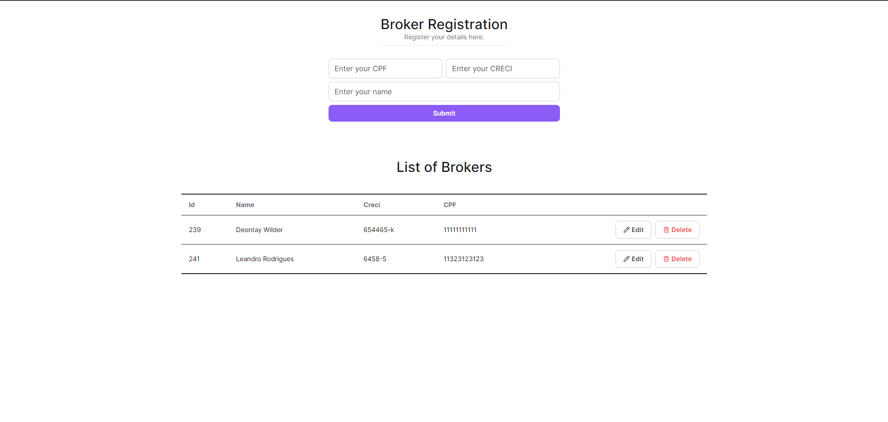

# Real Estate Broker CRUD - Manage Your Brokers Efficiently 🏢✍️

<br>

<p align="center">
  <a href="#-about-the-project">About the project</a> •
  <a href="#-technologies">Technologies</a> •
<a href="#-getting-started">Getting started</a> •
<a href="#-project-video">Project Video</a> •
<a href="#-api-routes">API Routes</a> •
<a href="#-license">License</a>
</p>

<p align="center">
 <kbd>
  </kbd> 
</p>

## 👩‍💻 About the project

This project is a straightforward CRUD application built with Next.js 14 on the front end, using server actions, and PHP on the back end. Created for study purposes, it allows you to register, search, read and delete brokers, all with a very pleasant interface and using the latest technologies available on the market.
 

## 🚀 Technologies

- [PHP](https://www.php.net/)
- [NextJs 14](https://nextjs.org/)
- [Radix UI](https://www.radix-ui.com/)
- [React Hook Form](https://react-hook-form.com/)
- [Sonner Toaster](https://sonner.emilkowal.ski/)
- [Tailwind Css](https://tailwindcss.com/)
- [Typescript](https://www.typescriptlang.org/)
- [Zod](https://github.com/colinhacks/zod)

## 💻 Getting started

### Requirements

- [PHP 8.3.8 ](https://www.php.net/)
- [Node.js](https://nodejs.org/en/)
- [NPM](https://www.npmjs.com/) ou [PNPM](https://pnpm.io/pt/) _(examples are with PNPM)_

### Running the Project

To run the application, you will need to start the PHP server in the `/server` folder and the web application in the `/web` folder.


**Start by accessing the server folder in your terminal:**

```bash
$ cd server
```

**To run the back-end application, follow these steps:**

Before starting the back-end server, make sure the database is correctly configured. Access `/server/src/Molde/Database.php` and adjust the connection parameters (`$host`, `$db_name`, `$username`, and `$password`) as needed.

In the `/server/database` folder, you will find an SQL script that can be used to create the application's database, as well as a mysqldump file with a backup of the database used.

After that, just start the server by accessing the public folder:

```bash
$ cd public/
$ php -S localhost:8000
```

**To run the front-end, follow these steps:**

Keep the PHP server running, open a new terminal, and access the `web` folder:

```bash
# Access the front-end folder
$ cd web

# Install the project dependencies
$ pnpm i

# Start the application
$ pnpm run dev

# Your front-end will be available at http://localhost:3000/
```

**NOTE:** In the `/frontend` directory, you will find the `.env` file. Inside this file, the URL for the PHP server is set to http://localhost:8000. If your server is on a different URL, you will need to update this file accordingly.


## 🎥 Project Video

To see the project in action, watch the video available at the link:
[Click here](https://drive.google.com/file/d/1JmyvBE2soyUYhp6N-pknTyXuCLPlZqiA/view)
 
 
## API Routes

The backend API routes are documented [Here.](./docs/rotas-api.md).


## 📝 License

This project is licensed under the MIT License - see the [LICENSE](LICENSE) file for details.

---

<p align="center">
  Made with 💜&nbsp; by  Leandro Rodrigues
</p> 